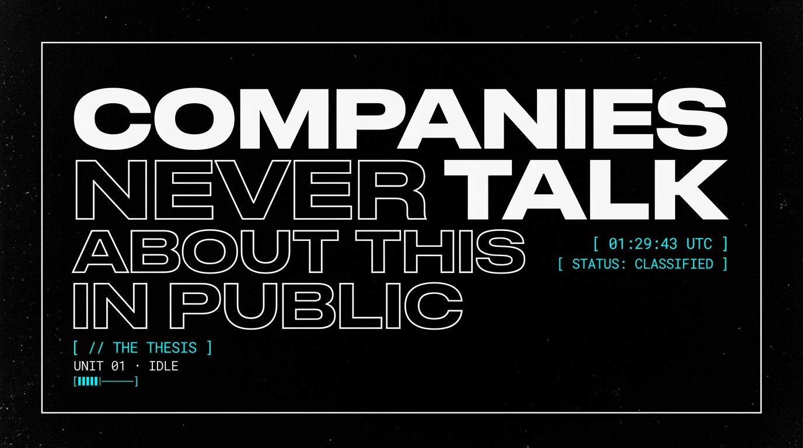
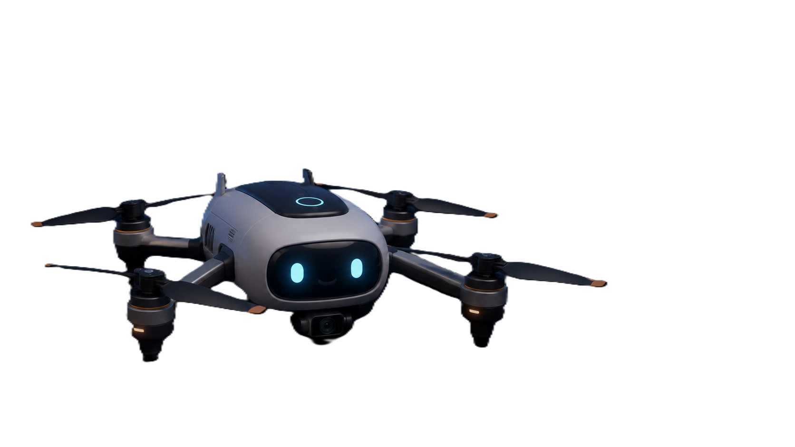
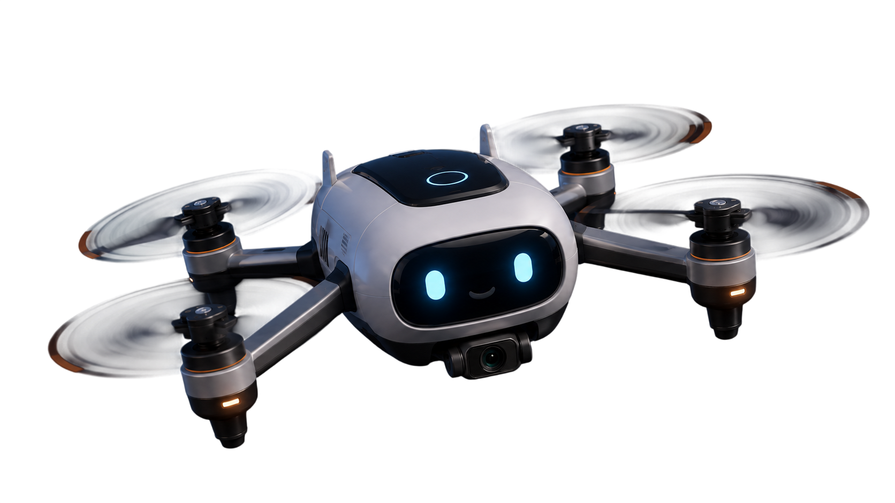
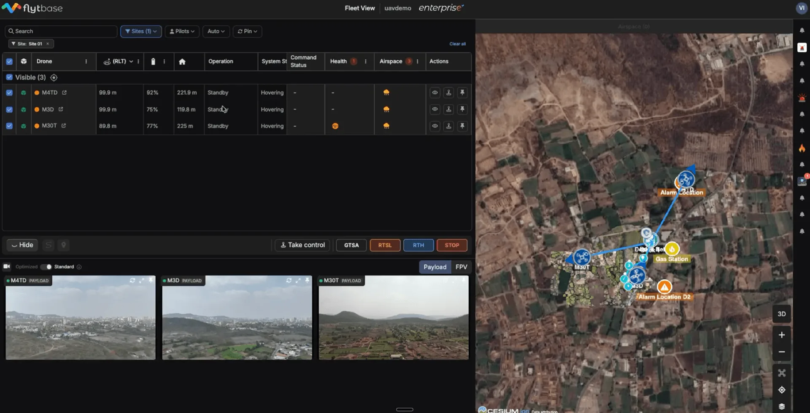
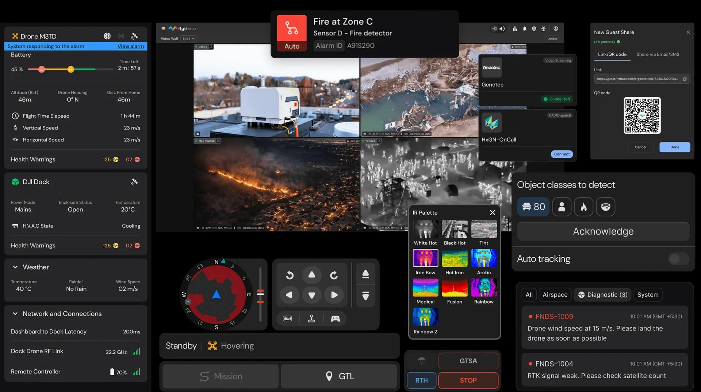
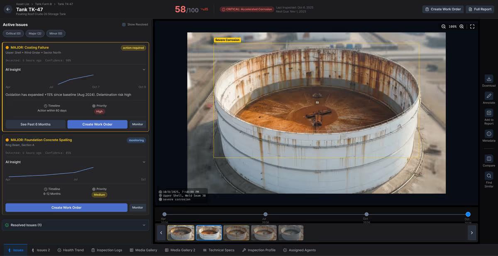
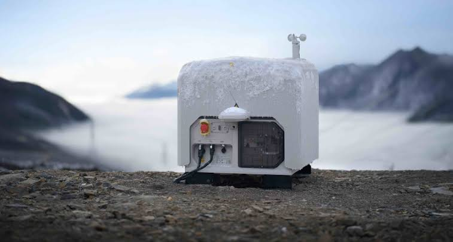
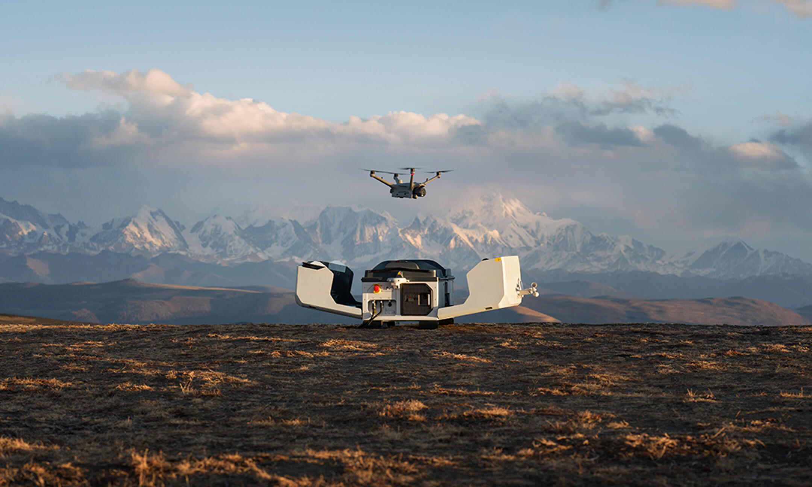

# Moodboard — NestGen '26 Scrollytelling
**Built by Sunil**

---

## Overall Mood: "The Briefing Room"

> Dark. Cinematic. Editorial. Like you've been handed a classified dossier about what Fortune 500 companies actually do with autonomous drones — and someone left the lights low on purpose.


---

## UI / UX Reference Direction

> Command center meets editorial magazine. Stripe's developer precision meets Apple's scroll-driven cinema. The interface should feel like a Bloomberg terminal had a baby with a film title sequence.


---

## Typography System

> Two fonts. One rule: **Syne screams, JetBrains Mono whispers.**



| Font | Weight | Role | Example |
|---|---|---|---|
| **Syne** | 800 | Headlines, section titles, hero text | `COMPANIES NEVER TALK ABOUT THIS IN PUBLIC` |
| **Syne** | 400 | Body paragraphs, descriptions | "A drone checks it every single day." |
| **JetBrains Mono** | 500 | Kickers, labels, tags, stats | `/ the thesis` · `unit 01 · idle` · `−7 min` |
| **JetBrains Mono** | 700 | Stat numbers, emphasis | `−60%` · `100×` · `<90 min` |

### Type Techniques Used
- **Stroke text** (`-webkit-text-stroke: 1px`) — hollow outline letters for secondary emphasis, creates visual rhythm against solid fills
- **Split-text animation** (Splitting.js) — each character enters independently in the hero, building tension letter by letter
- **ALL CAPS everywhere** — reinforces the military/industrial/briefing tone
- **Letter-spacing on monospace** — `.18em` to `.34em` depending on context, never tight

---

## Color Palette

```
┌─────────────────────────────────────────────────────────┐
│                                                         │
│   ██████  #050505  — Background (near-black)            │
│   ██████  #0c0d10  — Panel / card surfaces              │
│   ██████  #101114  — Marquee / strip backgrounds        │
│                                                         │
│   ██████  #FFFFFF  — Primary text                       │
│   ██████  #b9bdc2  — Body text (warm gray)              │
│   ██████  #9aa0a6  — Secondary text (mute-2)            │
│   ██████  #74777c  — Tertiary text (mute)               │
│                                                         │
│   ██████  #3fb9ff  — THE accent (cyan)                  │
│   ██████  #ff8a1f  — Amber (unused reserve)             │
│   ██████  #35d07f  — Confirmed / live status (green)    │
│                                                         │
└─────────────────────────────────────────────────────────┘
```

### Color Rules
- **Cyan (#3fb9ff)** is the only accent. It means: *live, active, confirmed, important*
- **Green (#35d07f)** appears only on "confirmed" speaker badges — with a pulsing dot animation
- **No gradients on text.** No multicolor. No rainbow. One hue, full commitment
- **Borders are always `rgba(255,255,255,0.10)`** — barely visible, structuring without shouting
- **Hover states** shift border to `rgba(63,185,255,0.38)` — cyan whispers in

---

## The Hardware — Real, Not Rendered

> Every drone image, every dashboard screenshot, every field deployment photo is **real FlytBase product imagery**. Nothing is a mockup.

### Drone





### Dashboards







---

## In the Wild — Field Deployments

> These aren't studio shots. These are drone docks deployed in actual terrain — mountains, solar farms, alpine ridgelines. The visual language is: **functional, weathered, real.**





---

## Textures & FX Layer

The page has four invisible layers that create atmosphere without the user consciously noticing them:

| Layer | What it does | Why |
|---|---|---|
| **Film grain** | `repeating-linear-gradient` scanlines at 50% opacity, `mix-blend-mode: overlay` | Makes the dark background feel analog, cinematic — not flat digital black |
| **Cursor spotlight** | 780px radial gradient of cyan at 13% opacity, follows the mouse via `gsap.quickTo` | Makes the page feel alive, responsive, like a surveillance light tracking you |
| **Vignette** | `radial-gradient` + `linear-gradient` overlay on each video theatre | Darkens edges, focuses attention on center, makes text readable over video |
| **Card light** | `radial-gradient(420px circle at var(--mx) var(--my))` on hover | Light follows cursor across card surface — feels like shining a flashlight on a document |

---

## Interaction Taste

| Interaction | Feel | Reference |
|---|---|---|
| **Scroll-scrubbed video** | You ARE the projector — scrub forward, scrub back, frame by frame | Apple iPhone product pages |
| **3D card tilt** | Subtle perspective shift on hover, ±7° rotation | Stripe dashboard cards |
| **Magnetic pull** | The date chip drifts toward your cursor | Linear.app buttons |
| **Drone banking** | The throughline drone tilts based on scroll velocity | Video game HUD elements |
| **Directional fly-in** | Elements arrive from authored directions (left, right, bottom) and retreat the same way | Editorial magazine page turns |
| **Count-up stats** | Numbers roll from 0 → final value on first view | Bloomberg data dashboards |

---

## Anti-References — What This Is NOT

> ⚠️ These were deliberately avoided. If the page ever starts feeling like any of these, something has gone wrong.

| ❌ Anti-Reference | Why it was rejected |
|---|---|
| Generic SaaS hero with gradient blob | Too cheerful. This story is about billion-dollar operational decisions, not a productivity app |
| Light mode / corporate blue | Fights the video content. The dashboards and drone footage are designed for dark interfaces |
| Carousel of team headshots | This isn't about FlytBase the company — it's about the *customers'* stories |
| Animated SVG illustrations | Too playful, too "explainer video." The tone should be documentary, not tutorial |
| Stock photography | Every image on the page is real FlytBase product/deployment imagery. Stock would break trust instantly |
| Particle.js / three.js background | Too "crypto landing page." The atmosphere comes from film grain + spotlight, not WebGL |
| Hamburger menu with nav links | There's nothing to navigate to — it's one continuous scroll story. The HUD rail handles wayfinding |

---

## Taste Direction — One Sentence

> **A classified briefing deck that someone accidentally left open on a terminal in a drone command center at 2am.**

That's the whole vibe. Every design decision flows from that sentence.
